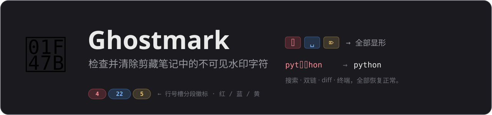
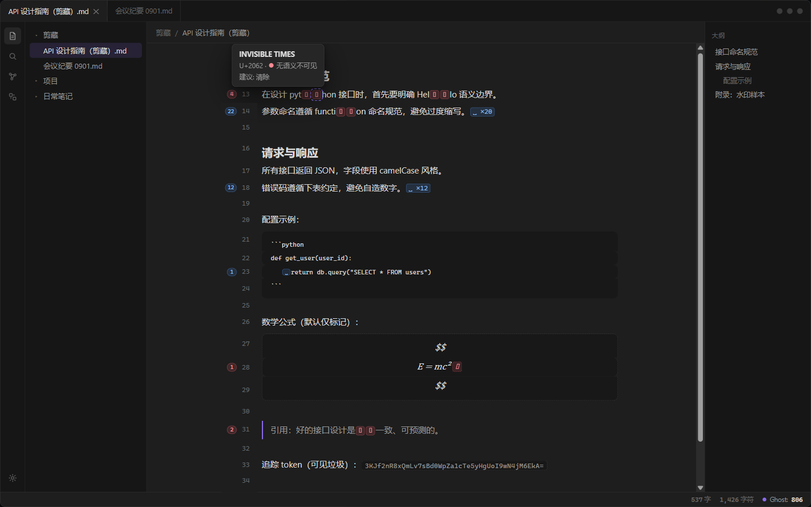
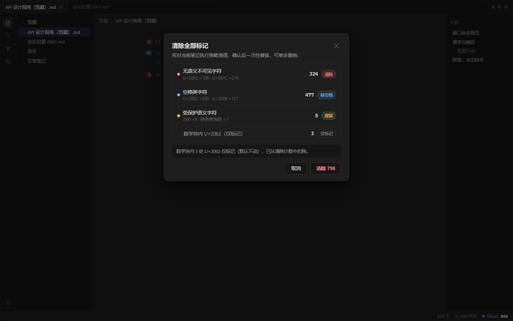
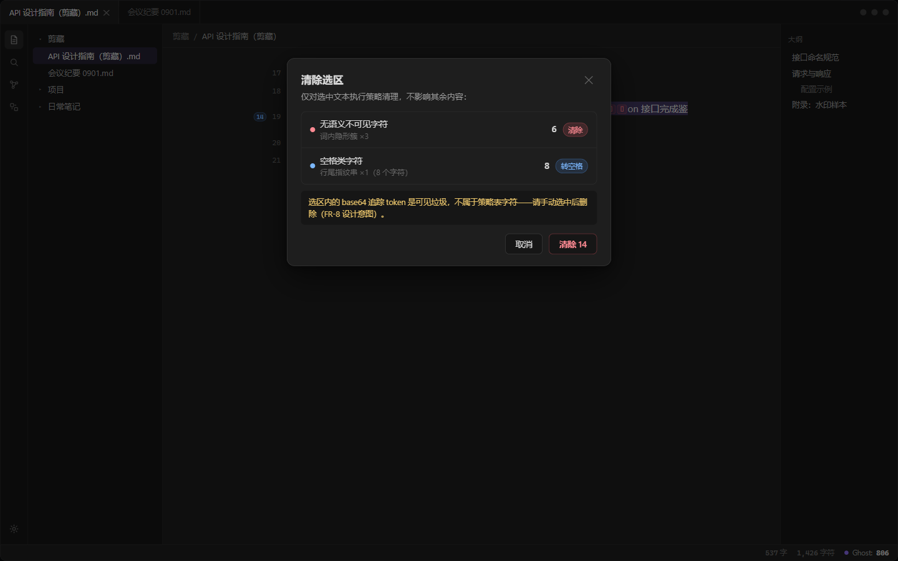
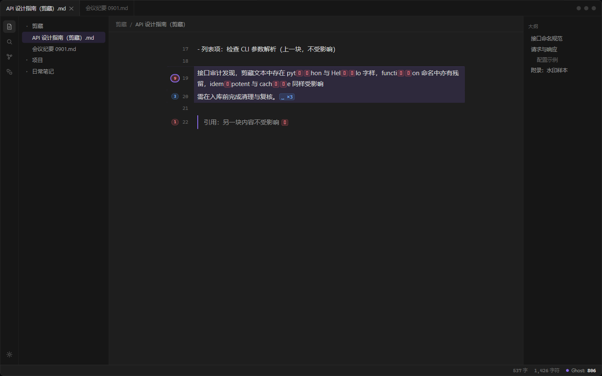
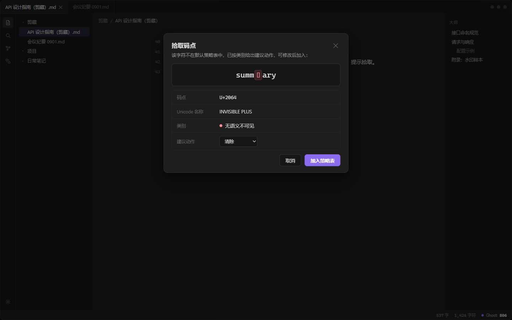
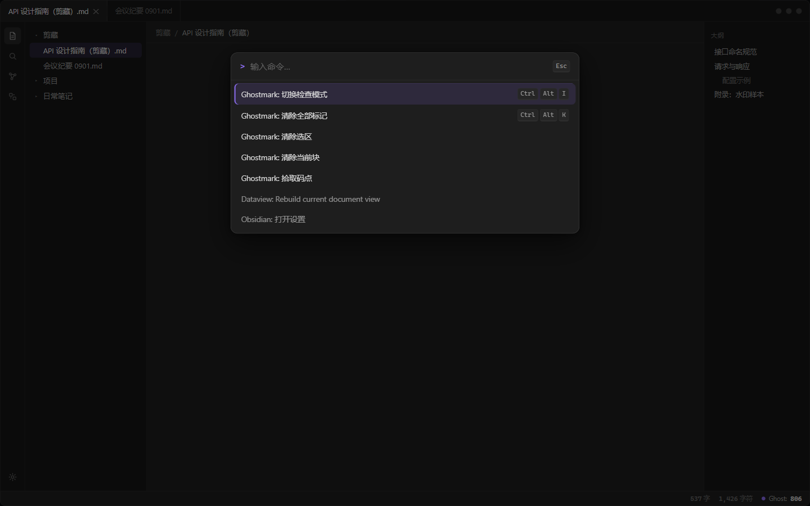
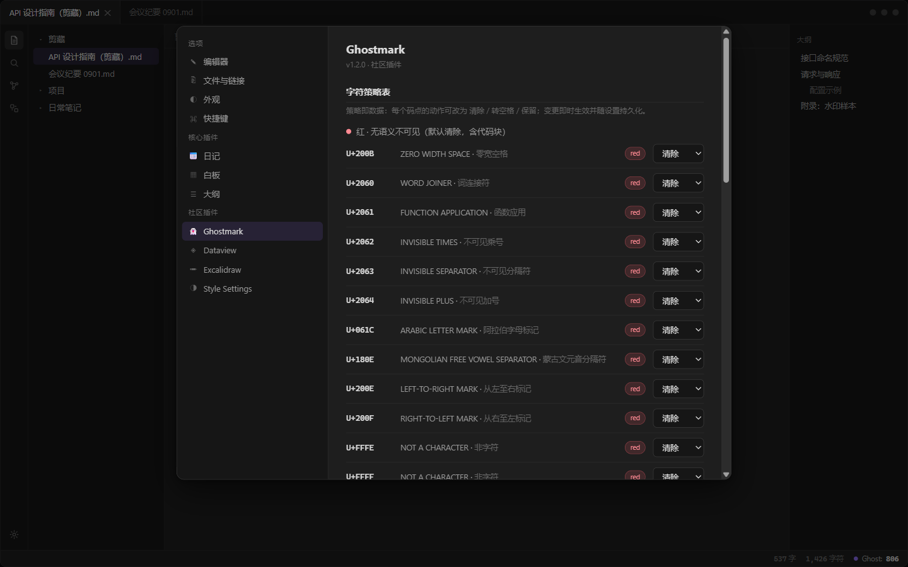
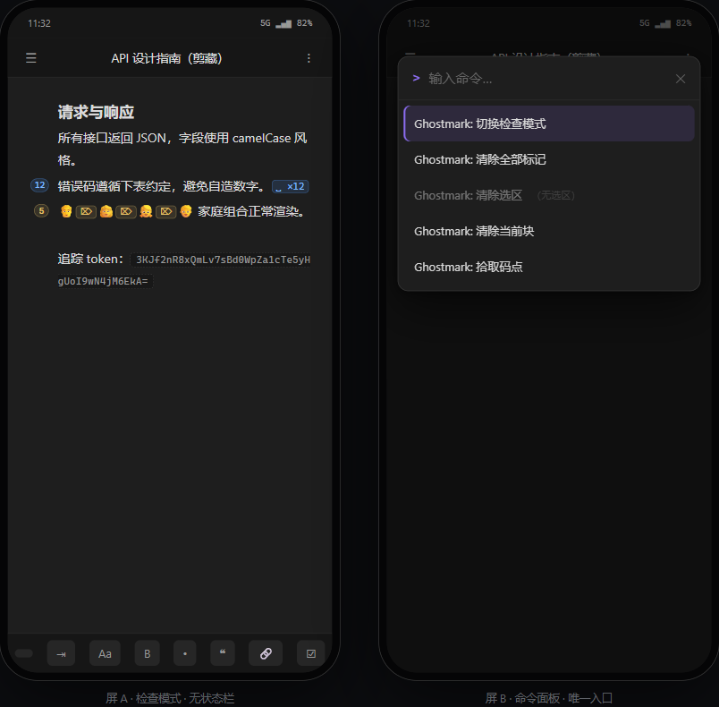

<div align="center">
  

  [](https://github.com/iceblyte/ghostmark/releases)
  [](https://github.com/iceblyte/ghostmark/actions/workflows/ci.yml)
  [](LICENSE)
  

  *[English](README.md) · 简体中文*
</div>

---

用 Obsidian Web Clipper 剪藏网页时，部分站点会在正文里注入**不可见水印字符**——词内的零宽字符簇、段尾的空宽空格指纹串、隐藏的双向控制符。它们渲染时完全不可见，却在暗中破坏：

- 🔍 **搜索**——藏着水印字符的词永远搜不到；
- 🔗 **链接与双链**——标题被污染后链接建立失败；
- 📝 **diff 与 git 历史**——整行看似未改实则已变；
- 💥 **复制进代码/终端**——`pyt⟪2062⟫hon` 直接跑不起来。

Ghostmark 把它们**全部显形**，并以"上下文感知、执行前确认、单步可撤销"的方式清理。

## 检查模式

一个开关（命令 / 状态栏点击 / 自行绑定的快捷键）让所有命中以行内字形呈现——Source 与 Live Preview 双模式可用，全仓库生效。



| 颜色 | 含义 | 默认动作 |
| --- | --- | --- |
| 🔴 红 `⌷` | 无语义不可见（U+200B、U+2060–2064、U+061C、U+180E、U+200E/F、U+FFFE/F、U+FEFF） | 清除——含代码块内 |
| 🔵 蓝 `␣` | 空格类（U+2002、U+2009、U+2007、U+202F、U+00A0） | 成串（≥2）整串删除、孤立转普通空格；代码块内逐一转空格 |
| 🟡 黄 `⌦` | 受保护语义（ZWJ 写死保护、ZWNJ、变体选择符） | 仅标记，永不改动 |

行号槽徽标为**分段式**——行内每种类别一段、各带数量——点击徽标清除所在块。悬停任意字形可见名称、码点、类别与建议动作；状态栏常驻 `Ghost: N` 实时命中数。

## 清理带确认

一切清除动作都会弹出按类别汇总的确认 Modal，以**单事务**应用（Obsidian 原生单步撤销开箱即用），并在完成后报告清理结果——包括按策略刻意保留的部分。



<div>
  
  
</div>

- **清除全部**——作用于整篇笔记，经上方 Modal 复核；
- **清除选区**——无选区时置灰；会提醒你 base64 追踪 token 属于*可见*垃圾，需手动删除；
- **清除当前块**——段落 / 列表项 / 引用块 / 表格行 / 整个代码或数学块 / frontmatter。默认免确认，因此仅在检查模式开启时可用（免确认以可见性为闸门）；行号槽徽标是第二入口。

## 拾取未知水印

新网站又发明了新水印字符？光标停在它上面（或选中一段文字），执行**拾取码点**——Modal 展示码点信息与按类别给出的建议动作。多个字符会弹勾选列表；设置中也可手动添加码点。



## 命令与设置



| 命令 | 建议快捷键（默认不占用，可在 设置 → 快捷键 中绑定） |
| --- | --- |
| Ghostmark: 切换检查模式 | `Ctrl/Cmd + Alt + I` |
| Ghostmark: 清除全部标记 | `Ctrl/Cmd + Alt + K` |
| Ghostmark: 清除选区 | —（需选区） |
| Ghostmark: 清除当前块 | —（需检查模式开启） |
| Ghostmark: 拾取码点 | — |

设置包含 21 行默认策略表（逐码点可改，含拾取追加区）、上下文规则（数学块**默认仅标记**——MathML 转写可能让 U+2062 承载真实的乘法语义）、界面选项与中英双语界面（默认跟随 Obsidian 界面语言）。



## 移动端

装饰与五个命令在移动端完整可用；仅状态栏为桌面专属——命令面板是移动端入口。



## 安装

暂未上架社区插件市场，手动安装：

1. 从[最新 Release](https://github.com/iceblyte/ghostmark/releases/latest) 下载 `main.js`、`manifest.json`（与 `styles.css`）；
2. 放入 `<vault>/.obsidian/plugins/ghostmark/`；
3. 在 *设置 → 第三方插件* 中启用 **Ghostmark**。

## 开发

```bash
npm install
npm run dev     # esbuild watch
npm run build   # tsc -noEmit + 生产构建 → main.js
npm run lint    # eslint（含 eslint-plugin-obsidianmd 上架规范）
npm test        # vitest（core 引擎 + fixture 验收断言）
```

核心引擎（`src/core/`）为纯 TypeScript，不依赖 Obsidian / CodeMirror，全部单测基于入库的合成样本 `src/core/fixtures/watermark-fixture.md`——不可见字符 801 个（U+2062 ×108、U+061C ×216、U+2002 ×300、U+2009 ×177），另有 ZWJ ×4、肤色修饰符 ×1：命中 806、可清除 798、清除全部后零残留。

**开发 vault 建议**：每次构建后将 `main.js`、`manifest.json`、`styles.css` 复制到测试 vault 的 `.obsidian/plugins/ghostmark/`；或配合 [pjeby/hot-reload](https://github.com/pjeby/hot-reload) 与 `npm run dev` 实现保存即重载。

## 许可

[MIT](LICENSE)

---

<sub>界面截图渲染自插件的 UI 设计原型；实际界面在其基础上增加了分段式行号槽徽标、子页面式设置与拾取勾选列表。</sub>
